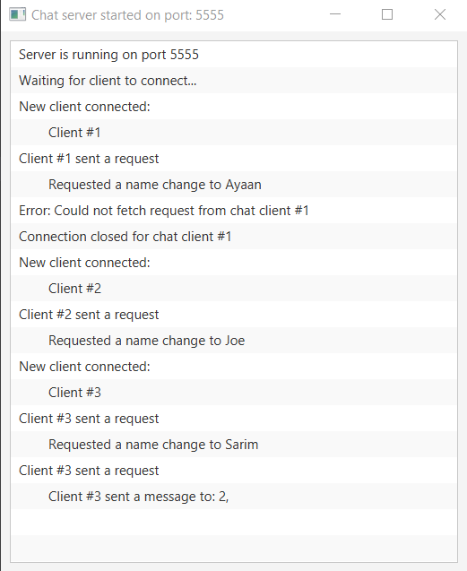

# 💬 Chat Server

Chat Server is a muti-threaded socket server used in [Chat-Client](https://github.com/N19htw1n9/Chat-Client) to create connections, and handle chat data. Chat Server is written in Java and uses the `java.net.Socket` library to build Socket connections.

Chat Server is also multi-threaded and creates a new thread for every new connection and handles these connections in an efficient manner.<br />

<br/>
Chat Server comes equipped with a GUI dashboard, created using JavaFX. This dashboard displays all active connections and also diplays packets sent by each connection. The GUI allows to create a server on a specified port that the clinet can then use to establish a TCP connections with.

## Usage

### Clone repo:

```shell
$ git clone https://github.com/N19htw1n9/Chat-Server.git
$ cd ./Chat-Server
```

### Build project using Maven

```shell
$ mvn pakcage
```

### Run server

```shell
$ mvn exec:java
```
